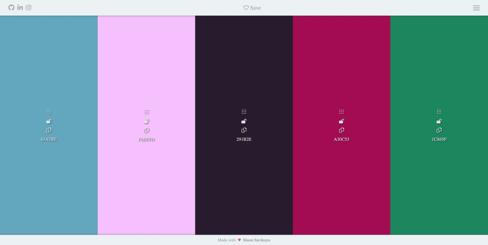

# JavaScript Colors Palette


Responsive colors palette app system made using JavaScript.

<hr />

### Installation Options

```
$ git clone https://github.com/sinansarikaya/javascript-colors-palette.git
```

<hr />

### Demo

#### [View Demo](https://sinansarikaya.github.io/javascript-colors-palette/)



<hr />

### Try yourself

You can try to make it yourself by looking at the design in Figma.
                               
#### [View the design in Figma](https://www.figma.com/file/ayNafC547sY1sNEHo7YtZl/Colors-Palette-App?node-id=0%3A1)
